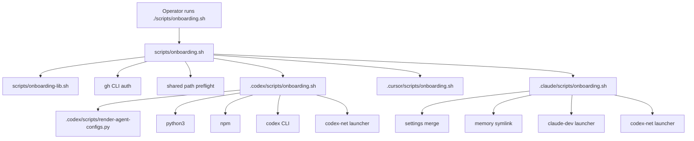
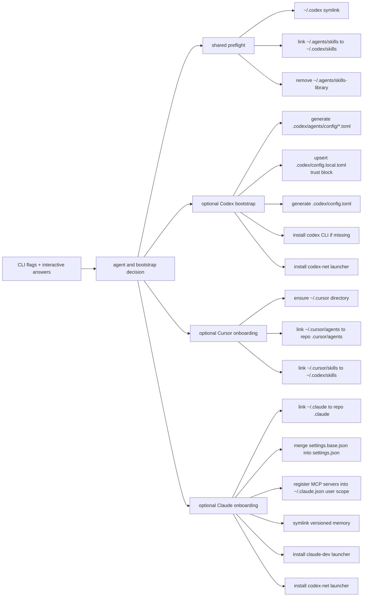
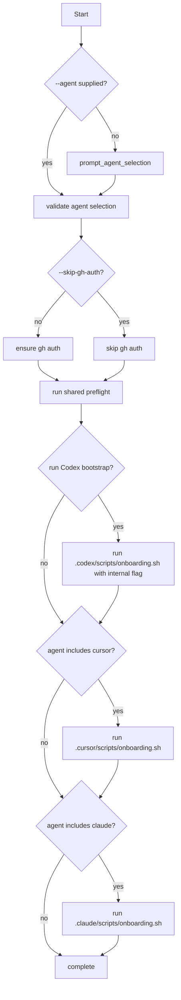
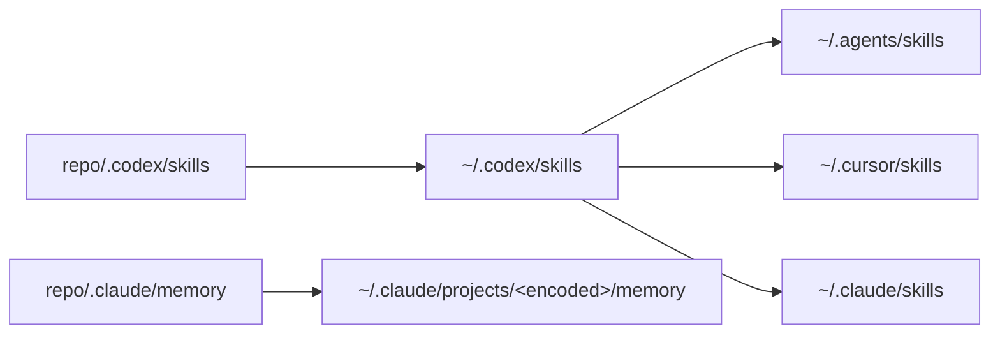

# Onboarding

This document is the canonical source of truth for onboarding in `codex-home`.

Use it for:
- what `./scripts/onboarding.sh` changes
- how the orchestrator decides which steps to run
- which files and runtime paths depend on each other
- how to validate or rerun onboarding safely

High-level rule:
- `README.md` gives quick-start guidance and links here
- `docs/git-pr-flow.md` references onboarding only where Git/PR workflow depends on it

## Entry Points

Primary operator entrypoint:

```bash
./scripts/onboarding.sh
```

Supported flags:
- `--agent {codex|cursor|claude|all}`
- `--codex-home PATH`
- `--cursor-home PATH`
- `--claude-home PATH`
- `--skip-gh-auth`
- `--with-codex-bootstrap`
- `--without-codex-bootstrap`

Default behavior:
- Interactive mode prompts for the target agent and defaults to `all`.
- Automation can bypass prompts by passing `--agent`.
- Codex bootstrap runs automatically for `codex` and `all`.
- `cursor` and `claude` do not run Codex bootstrap unless `--with-codex-bootstrap` is passed.
- `--without-codex-bootstrap` is supported for `codex`, `cursor`, `claude`, and `all`.

Internal-only entrypoint:
- [`.codex/scripts/onboarding.sh`](/Users/lume/repos/codex-home/.codex/scripts/onboarding.sh) is the Codex bootstrap implementation used by the root orchestrator.
- Do not run it directly. It rejects operator use unless the root orchestrator passes its hidden internal flag.

## Ownership

Script ownership:
- Orchestrator: [`scripts/onboarding.sh`](/Users/lume/repos/codex-home/scripts/onboarding.sh)
- Shared helpers: [`scripts/onboarding-lib.sh`](/Users/lume/repos/codex-home/scripts/onboarding-lib.sh)
- Codex bootstrap implementation: [`.codex/scripts/onboarding.sh`](/Users/lume/repos/codex-home/.codex/scripts/onboarding.sh)
- Cursor-specific wiring: [`.cursor/scripts/onboarding.sh`](/Users/lume/repos/codex-home/.cursor/scripts/onboarding.sh)
- Claude-specific wiring: [`.claude/scripts/onboarding.sh`](/Users/lume/repos/codex-home/.claude/scripts/onboarding.sh)

## Dependency Map



## Data Flow



Input sources:
- CLI flags
- interactive prompt for agent selection
- existing local runtime paths such as `~/.codex`, `~/.cursor`, `~/.claude`, and `~/.agents`
- tracked repo inputs such as `.codex/config.base.toml`, `.codex/scripts/render-agent-configs.py`, and the tracked `.cursor` / `.claude` homes

Generated or managed outputs:
- `~/.codex` symlink
- `~/.agents/skills` symlink
- removal or backup of deprecated `~/.agents/skills-library`
- `~/.cursor/agents` symlink
- `~/.cursor/skills` symlink
- `~/.claude` symlink
- `~/.claude/settings.json` (merged from `.claude/settings.base.json`)
- `~/.claude.json` `mcpServers` entries (user-scope, merged from `.codex/config.base.toml` + `.credentials.json`)
- `~/.claude/projects/<encoded>/memory` symlink to versioned `.claude/memory/`
- `claude-dev` launcher script (if Claude CLI available)
- `codex-net` launcher script (if Codex CLI available; installed by both Codex bootstrap and Claude onboarding)
- `.codex/agents/config/*.toml`
- `.codex/config.local.toml` trust block for this repo
- `.codex/config.toml`

## Execution Flow



Behavior details:
- The root orchestrator always owns `gh` auth validation, bootstrap decisions, and shared path setup.
- Shared `~/.codex` and `~/.agents/skills` wiring happens for every agent selection, even when Codex bootstrap is skipped.
- Cursor onboarding manages subpaths inside `~/.cursor`; it does not replace the whole directory when a normal directory already exists.
- Claude onboarding manages `~/.claude` as a symlink to the tracked repo home.
- If a managed path already exists and points elsewhere, onboarding backs it up with a timestamped suffix before replacing it.
- If a managed symlink already points to the correct destination, onboarding leaves it unchanged and logs that it is already correct.

## Flag Contract

`--with-codex-bootstrap`:
- `--agent codex`: run Codex bootstrap
- `--agent cursor`: run Codex bootstrap, then Cursor onboarding
- `--agent claude`: run Codex bootstrap, then Claude onboarding
- `--agent all`: run Codex bootstrap, then Cursor and Claude onboarding

`--without-codex-bootstrap`:
- `--agent codex`: shared setup only; skip Codex bootstrap work
- `--agent cursor`: shared setup plus Cursor onboarding only
- `--agent claude`: shared setup plus Claude onboarding only
- `--agent all`: shared setup plus Cursor and Claude onboarding; skip Codex bootstrap

Invalid combination:
- passing both bootstrap flags is an error

## What Each Step Does

### 1. GitHub CLI auth

Implemented in the shared library:
- validates `gh auth status`
- runs `gh auth login -h github.com` when auth is missing
- can be skipped with `--skip-gh-auth`
- in interactive environments, can fall back to the Docker-based `gh` wrapper when native `gh` is missing and Docker is available

This auth check runs before every onboarding flow unless skipped.

### 2. Shared path preflight

The root orchestrator always:
- creates `~/.codex` as a symlink to the repo’s `.codex` directory
- creates `~/.agents/skills` as a symlink to `~/.codex/skills`
- removes the deprecated managed `~/.agents/skills-library` path

Shared skills topology:



Single-source rule for skills:
- repo source of truth: `.codex/skills`
- all runtime skill views resolve back to that same source

### 3. Codex bootstrap

When enabled, the internal Codex script:
- generates `.codex/agents/config/*.toml` from [`.codex/scripts/render-agent-configs.py`](/Users/lume/repos/codex-home/.codex/scripts/render-agent-configs.py)
- upserts a trusted project block into `.codex/config.local.toml`
- generates `.codex/config.toml` by concatenating `.codex/config.base.toml` with `.codex/config.local.toml`
- ensures the `codex` CLI exists, installing it with `npm install -g @openai/codex` if needed
- installs the `codex-net` launcher (see Launcher install directory below)

Generated config model:
- tracked shared defaults: `.codex/config.base.toml`
- machine-local overlay: `.codex/config.local.toml`
- generated runtime config: `.codex/config.toml`
- generated role configs: `.codex/agents/config/*.toml`

Do not edit generated files directly:
- `.codex/config.toml`
- `.codex/agents/config/*.toml`

### 4. Cursor onboarding

Cursor onboarding:
- ensures `~/.cursor` exists as a directory
- preserves unrelated existing content under `~/.cursor`
- manages only `~/.cursor/agents` and `~/.cursor/skills`
- migrates a legacy `~/.cursor` symlink by backing it up and replacing it with a real directory

Managed Cursor paths:
- `~/.cursor/agents -> repo/.cursor/agents`
- `~/.cursor/skills -> ~/.codex/skills`

### 5. Claude onboarding

Claude onboarding:
- creates `~/.claude` as a symlink to the tracked repo `.claude`
- exposes `~/.claude/skills` through the tracked `.claude/skills` symlink, which points to `../.codex/skills`
- merges `.claude/settings.base.json` into `settings.json` (preserves user overrides, adds missing base keys)
- registers MCP servers from `.codex/config.base.toml` into `~/.claude.json` under `mcpServers` (user scope); merges credentials from `.credentials.json` at repo root if present
- symlinks versioned memory: `~/.claude/projects/<encoded>/memory` -> `repo/.claude/memory`
- installs `claude-dev` launcher with tmux and worktree integration (if the `claude` CLI is available)
- installs `codex-net` launcher with the same feature set (if the `codex` CLI is available)

Both launchers share identical behavior (see Launcher behavior below). Claude onboarding installs both so the agent launchers are available regardless of whether Codex bootstrap was run.

### Launcher behavior

`claude-dev` and `codex-net` share the same interactive scaffold:

- Prompts for tmux session use and session name (skipped if args are passed or stdin is not a tty)
- Prompts for worktree selection from `.worktrees/` at the project root, or offers to create a new one
- Worktrees are created at `<git-root>/.worktrees/<name>` by default; custom absolute paths are supported
- Runs a post-create hook if a new worktree was just created (see Post-create hook below)
- Creates or attaches to a tmux session, then execs the CLI

Launcher flags (same for both):

| Flag | Env var | Default | Description |
|---|---|---|---|
| `--no-tmux` | `CLAUDE_DEV_NO_TMUX=1` / `CODEX_NET_NO_TMUX=1` | off | Skip tmux session management |
| `--worktree PATH` | `CLAUDE_DEV_WORKTREE` / `CODEX_NET_WORKTREE` | (prompt) | Use or create worktree at PATH |
| `--session NAME` | `CLAUDE_DEV_TMUX_SESSION` / `CODEX_NET_TMUX_SESSION` | `claude-work` / `codex-work` | Tmux session name |
| `--` | — | — | Forward remaining args to the CLI |

tmux session management:

| Scenario | Behavior |
|---|---|
| Not in tmux | `tmux new-session -A -s <session>` |
| In tmux, different session | Create session detached, then `switch-client` to it |
| In tmux, already in target session | Exec CLI directly |
| tmux not installed | Warn and exec directly |

### Post-create hook

When a new worktree is created, both launchers look for and run:

```
<project-root>/.hooks/post-worktree-create.sh
```

The hook runs in the context of the new worktree directory with these env vars set:

| Variable | Value |
|---|---|
| `WORKTREE_PATH` | Absolute path to the new worktree |
| `MAIN_ROOT` | Absolute path to the main repo checkout |

The hook is optional — launchers silently skip it if the file does not exist. It only fires for **newly created** worktrees; selecting an existing worktree does not trigger the hook.

Existing worktrees (selected from the picker) are never re-initialized.

### Launcher install directory

Both launchers are installed by `resolve_launcher_bin_dir()` in `scripts/onboarding-lib.sh`:

1. `$XDG_BIN_HOME` if set
2. `~/.local/bin` if already in `$PATH`
3. `~/bin` if already in `$PATH`
4. `~/.local/bin` (created, with a PATH warning) — default fallback on all platforms

The function never writes to package-manager directories (`/opt/homebrew/bin`, `/usr/local/bin`).

Base settings provide:
- Default model: sonnet with medium reasoning effort
- Agent teams: `CLAUDE_CODE_EXPERIMENTAL_AGENT_TEAMS=1` with auto teammate mode
- Error-capture hook from self-improving-agent

MCP servers (playwright, linear, context7) are sourced from `.codex/config.base.toml` and written into `~/.claude.json` under `mcpServers` as user-scoped servers (available across all projects). If `.credentials.json` exists at the repo root, access tokens are merged as `Authorization: Bearer` headers on matching servers.

Managed Claude paths:
- `~/.claude -> repo/.claude`
- `~/.claude/CLAUDE.md` (user-scope agent instructions, tracked at `.claude/CLAUDE.md`)
- `~/.claude/settings.json` (merged from base)
- `~/.claude.json` `mcpServers` (user-scope MCP registration)
- `~/.claude/projects/<encoded>/memory -> repo/.claude/memory`
- `claude-dev` launcher in the resolved launcher bin dir (see Launcher install directory)
- `codex-net` launcher in the resolved launcher bin dir (see Launcher install directory)

## Filesystem Effects and Safety Rules

Path management uses helper functions in [`scripts/onboarding-lib.sh`](/Users/lume/repos/codex-home/scripts/onboarding-lib.sh).

Safety rules:
- existing conflicting paths are backed up with a timestamped suffix
- existing correct symlinks are reused
- Cursor directory contents outside the managed subpaths are preserved
- deprecated managed `~/.agents/skills-library` is removed when it matches the old managed layout
- launcher writes are atomic

Backup patterns:
- `path.backup.TIMESTAMP`
- `path.symlink.backup.TIMESTAMP`

## Validation

Primary regression check:

```bash
./.codex/scripts/test-onboarding.sh
```

Covered scenarios:
- default Codex selection bootstraps Codex
- `codex --without-codex-bootstrap` keeps shared wiring only
- interactive menu accepts a selection
- cursor-only onboarding can skip Codex bootstrap
- cursor-only onboarding can explicitly add Codex bootstrap
- all-agent onboarding wires Codex, Cursor, and Claude
- all-agent onboarding can skip only the Codex bootstrap portion
- GitHub auth runs even for cursor-only onboarding
- deprecated `~/.agents/skills-library` is removed
- Cursor onboarding preserves existing state under `~/.cursor`
- legacy `~/.cursor` symlink is migrated safely
- direct execution of `.codex/scripts/onboarding.sh` is rejected
- conflicting bootstrap flags fail cleanly
- rerunning onboarding is idempotent

Related validation and maintenance commands:

```bash
./.codex/scripts/validate-role-skill-topology.py
./.codex/scripts/check-config-migration.sh
./.codex/scripts/setup-git-hooks.sh
```

## Quick Start

Interactive:

```bash
./scripts/onboarding.sh
```

Automation examples:

```bash
./scripts/onboarding.sh --agent codex --skip-gh-auth
./scripts/onboarding.sh --agent codex --without-codex-bootstrap --skip-gh-auth
./scripts/onboarding.sh --agent cursor --with-codex-bootstrap --skip-gh-auth
./scripts/onboarding.sh --agent all --without-codex-bootstrap --skip-gh-auth
```

After Codex bootstrap:

```bash
codex-net
```
